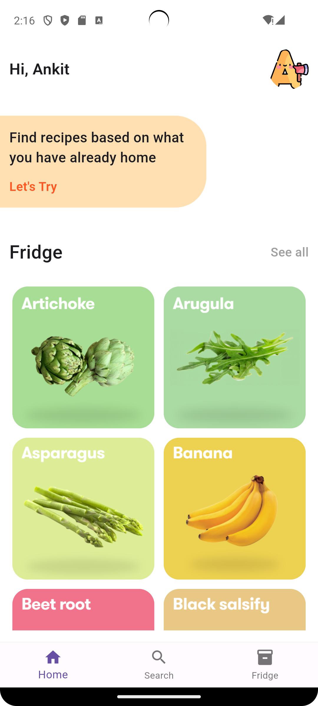
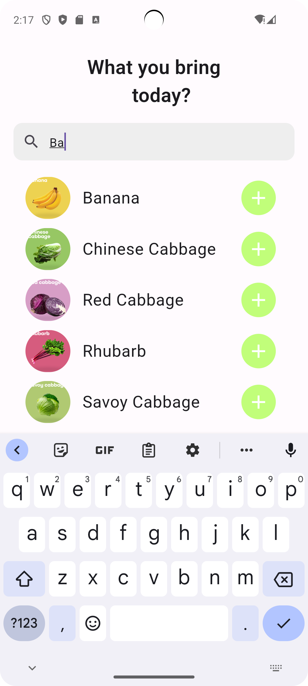
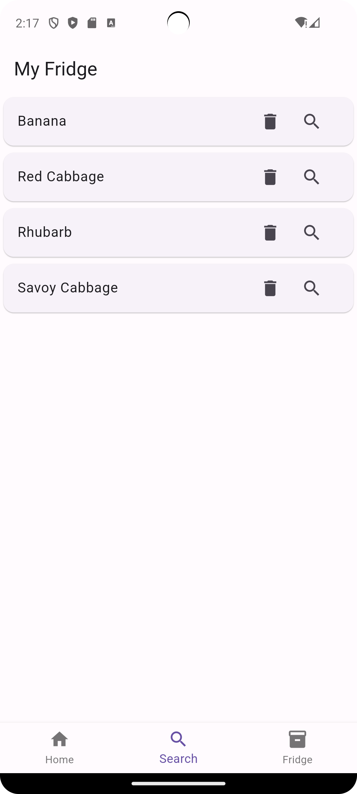

## AI powered Vegetable-Inventory app ⚡
This app gives you the power of AI, Now you dont need to add vegetable by your finger scan and add to your fridge.🛒
We give you recommendation based on vegetable you have in your fridge, dont need to think, just sit on your couch and get recommendations. 🎁
### NOTE - Currently in developement phase not for use

### Kaggle notebook- Image Classifier
Link - https://www.kaggle.com/code/ankitbourasi/vegetable-classification-using-inception-v3
### Techstack
- Flutter
- Provider
- Tensorflow lite
- CNN
### Screenshot-

  

## Getting Started

This project is a starting point for a Flutter application.

A few resources to get you started if this is your first Flutter project:

- [Lab: Write your first Flutter app](https://docs.flutter.dev/get-started/codelab)
- [Cookbook: Useful Flutter samples](https://docs.flutter.dev/cookbook)

For help getting started with Flutter development, view the
[online documentation](https://docs.flutter.dev/), which offers tutorials,
samples, guidance on mobile development, and a full API reference.
